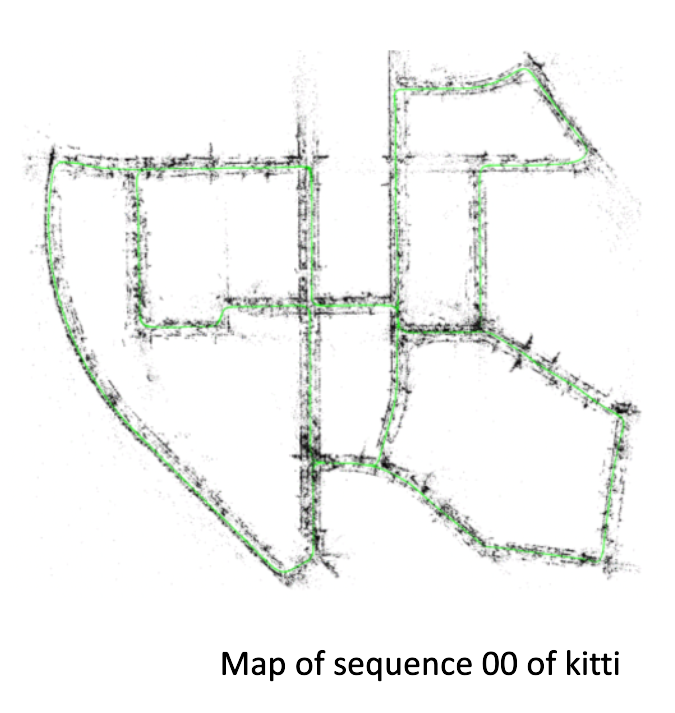
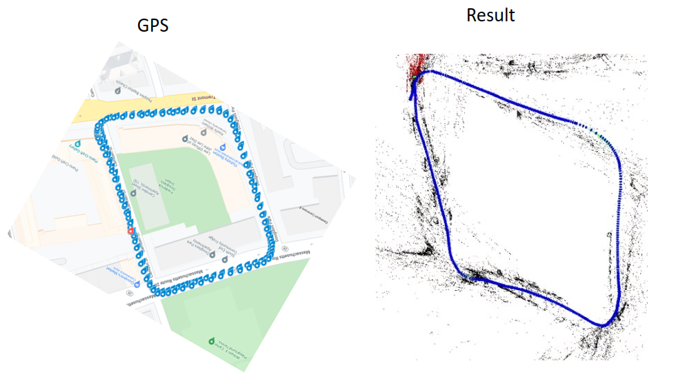

# ORB SLAM2 
## 1. Installing Softwares 

   https://github.com/raulmur/ORB_SLAM2.git

Follow the instructions provided in ORB SLAM2 github and install the listed softwares and their dependencies

    1. Pangolin 0.5
    2. OpenCV 4.5.5
    3. Eigen3 [3.2.x]
    4. DBoW2 
    5. G2o 
    6. ROS
    7. ORB SLAM2

## 2. Download the Dataset 
    
   ##### 1. KITTI Dataset 
http://www.cvlibs.net/datasets/kitti/eval_odometry.php
    
Download the kitti odometry dataset (grayscale 22GB) which contains 22 sequences of left and right stereo
images along with their timestamps and calibration files

   ##### 2. Nuance Dataset 
https://drive.google.com/file/d/1ZDuIv7KWfbPpi1BPE1L81xVp6kpRJEx7/view?usp=sharing
    
Download the lastLoop.bag rosbag file from the google drive with has following topics 

## 3. Running ORB-SLAM2 with KITTI Dataset

    cd PATH_TO_INSTALLED ORB_SLAM2
    ./Examples/Stereo/stereo_kitti Vocabulary/ORBvoc.txt Examples/Stereo/KITTIX.yaml PATH_TO_KITTI_DATASET_FOLDER/dataset/sequences/SEQUENCE_NUMBER

Execute the following command. Change KITTIX.yamlto KITTI00-02.yaml, KITTI03.yaml or KITTI04-12.yaml for sequence 0 to 2, 3, and 4 to 12 respectively.   Change PATH_TO_KITTI_DATASET_FOLDER to the uncompressed dataset folder. Change SEQUENCE_NUMBER to 00, 01, 02,.., 11.
    
Running Video for 00 Sequence : https://drive.google.com/file/d/1OOmw0lb5t3Xz871he5YQtSvAuve78FUN/view?usp=sharing

  

## 4. Running ORB-SLAM2 with Nuance Dataset

### Data Preprocessing :
    
   1. Extract the left and right images from the rosbag file using bagtoimage.py

      - specify the rosbag filename 

      - change the topic name from which images needs to be extracted in file [/camera_array/cam0/image_raw] [/camera_array/cam3/image_raw]

      - specify the path to store the images [image_0/image_1]

      
    cd  PATH_TO_ROSBAG 
    python3 bagtoimage.py

   2. Generate the times.txt file using bagtotime.py

    cd  PATH_TO_ROSBAG 
    python3 bagtotime.py

   3. Generate the clahe left and right images using clahe.py
   
      - Clahe algorithm is applied to left and right images for improving the contrast of the images 

    cd  PATH_TO_ROSBAG 
    python3 clahe.py

   4. Get the ground truth latitude and longitude GPS coordinates by using gps.py

    cd PATH_TO_ROSBAG
    python3 gps.py

### Run the ORB_SLAM2 :

   - ORB_SLAM2 can be run the both normal left and right images and clahe left and right images

   Data Organization:

      seq:
         - image_0     # left images folder
         - image_1     # right images folder
         - times.txt  # times stamp of images generated
      
   Final Command:

    cd PATH_TO_ORB_SLAM2
    ./Examples/Stereo/stereo_kitti Vocabulary/ORBvoc.txt PATH_TO_YAML/param.yaml PATH_TO_DATASET/seq

Running Video : https://drive.google.com/file/d/1hL9pqxqNSOl3sOVXaO3raeSeyj2BwpLB/view?usp=sharing

   
   
     

    

    

      

    

