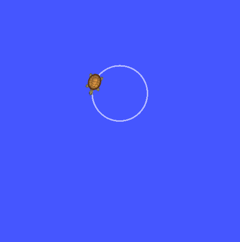

## Publisher and Subcriber Node 
Run the following commands 
 - roslaunch beginner_tutorials turtle_pub_sub.launch

This lauch file will start three nodes: 
 - turtlesim node : this will launch turtlebot 
 - publisher node : this will commands the turtlebot to rotate in circle 
 - subscriber node : this node will subcribes to publisher node and gets turtlebot position and velocity 

## Client and Service Node
Run the following commands for adding two integer numbers [input = x,y] 
 - rosrun beginner_tutorials add_two_ints_client.py x y || eg : rosrun beginner_tutorials add_two_ints_client.py 1 3
    - This node will request the service node for adding two numbers

 - rosrun beginner_tutorials add_two_ints_srver.py
    - This node will process the request sent by client and sends back to client 

 
